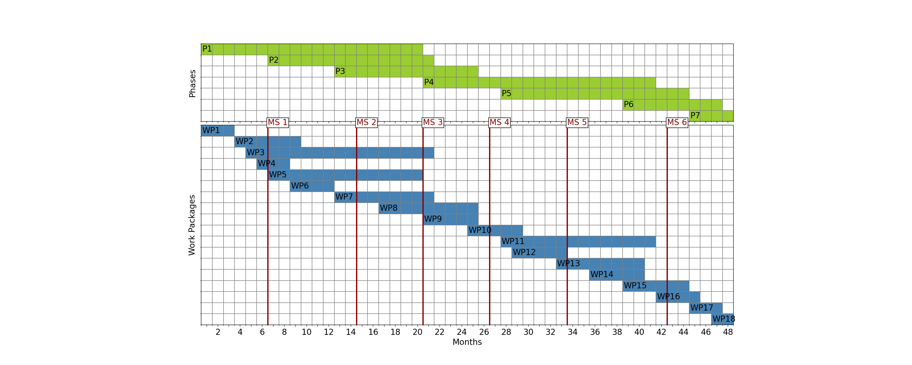

# lazy-gantt
Renders a Gantt chart from a .csv file, configurable via a .yaml file.

### For whom? ###

People who:
* need a Gantt chart, but also need to stick to a spreadsheet calculation for reasons of time or routine (e.g., since it is used by the project team), but want to work as little as possible within the spreadsheet calculation program
* care about the financial stuff in a project applications by adapting Microsoft Excel spreadsheets (because, e.g, this is predetermined by their working institution), but do not want to invest any time in the appearance and exact content of the application file
* want to play around with pandas and matplotlib

In any case, little coding experience is advantageous; at least, for preparing the working environment and getting the code to run.

#### Use case ####

You are working on a project application, need to include a Gantt chart and, as usual, time is very short.
You are scheduling the work load of your employees in a spreadsheet application (e.g., Microsoft Excel) and create a Gantt chart by filling spreadsheet cells with color to visualize bars that should display work packages (such as here: https://templates.office.com/en-us/simple-gantt-chart-tm16400962).
In this process, you notice several times, that you either need clones of your employees or have to adapt the duration of work packages again and again to manage the planned task in the available months with the available employees.

You're ending up in repetitively clicking in spreadsheet cells to adapt their colors in order to illustrate the distribution and length of work packages. To make things worse, you finally notice, that the chart captures too much space in your application file, so that the application exceeds the allowed number of pages. You end up in time-consuming click marathons in the spreadsheet.

### Features ###
This code creates a Gantt chart involving:
- the starting and ending points of work packages over the full project period
- voluntarily: important milestones along the project
- voluntarily: phases of the project
- not implemented yet: ~~the working loud (counted in months) invested per work package by all employees~~

### Set-up ###

The code was tested in Python 3.9.2 on Windows 10 and requires at least
* pandas
* numpy
* matplotlib
* pyyaml

After installation, open the **example.py** and execute the code for generating
a Gantt chart.

Version 0.1.

#### Installation on Windows ####

There are many free scientific Python distributions out there, such as Anaconda.

In Miniconda, I prepared my working environment as in the following:
1. Open Anaconda Powershell Prompt
1. Create conda environment: `conda create -n lazygantt python=3.9`
1. Activate conda environment: `conda activate lazygantt` (You need to execute this step every time, when you have closed the Anaconda shell.)
1. Install necessary packages: `conda install pandas`, repeat this for other necessary packages
1. If you want to run Spyder as IDE:
	1. Install spyder: `conda install sypder`
	1. Start spyder without blocking the shell: `start spyder`

For more information about Anaconda environments, please visit the conda docs: https://docs.conda.io/projects/conda/en/latest/user-guide/tasks/manage-environments.html

### Repository Details ###

This projects includes:
* A csv file that holds the data of your work packages and work load. Commonly, it was exported from a spreadsheet calculation program, e.g. Excel.
* A configuration file that controls the appearance of the Gantt chart, e.g., bar colors; image format, size, and ratio.

#### Content of .csv File ####
The file minimal_gantt.csv in directory ./files/ illustrates the minimal necessary content of a csv file. Currently, the following columns are used for further processing:
* **start**: 	start of work packages, in relative months from beginning of the project, starting from month 0. Example: 8, for a package starting in month 8 of the project
* **duration**: duration of work packages in months. Example: 3, for a package lasting 3 months
* **phase_number**: Ascending number from 1 to n, stated for each work package. Example: 2, for phase 2. Optional: If column is not included in csv file or contains no integers, the columns is not used.

Please note:
* the delimiter for .csv files is mandatorily a *semicolon*
* Do not change the naming of the columns "start", "duration", or "phase_number"; otherwise, the code will fail.
* You may extend the csv file with additional columns and rows if they are necessary for internal calculations (as an example, see ./files/gantt.csv)
* After loading the csv file into LazyGannt, unnecessary *rows* are deleted after import as long as the "start" cell stayed empty (i.e, no character inputs in these cells). Unnecessary *columns* remain untouched in processing.

#### Content of .yaml File ####
The yaml file relates to matplotlib plotting parameters.
See the comments within the yaml file.

### Possibilities for Further Development ###

You are invited to contribute.
Here follows a spontaneous collection of ideas:

* Add easier support for multiple languages via separating configuration files for visual elements and labels from each other
* Add functions to handle data input by hand, e.g. initialize packages and phases from numpy arrays and configuration data from dictionaries (without additional data input necessary)
* Add integration of date specifications, e.g. state a starting date of the project which is used to generate datetime labels
* Demo mode for Chart class to show text label positions that are listed in yaml file
* Intelligent color schemes, e.g., automatically adapt text color, if colors of underlying chart elements impede readability
* Rainbow color scheme for work packages (because Gantt charts can be fun ;))
* Revise DataColumnChecker for creation of checking routines
* Shift data wrangling tasks to utils class (e.g., composition of packages and phases and preparation for plotting)
* Much more testing for faulty insertions in configuration files

### Background of This Project ###
This project came to life, since I was getting mad about a spreadsheet calculation while producing a Gantt chart for a project application (for details, consult the description of the use case above ;)). In 2019, I've written a short python script which served as a rough template for LazyGantt.

I laid my personal focus in this project on:
- Separation into data and visualization components (i.e., Gantt and Chart class)
- Gaining experience with processing of data from spreadsheet calculation and configuration files
- Optimize plotting by avoiding plt.barh() and switching to plt.imshow() with a more efficient plotting routine and simplier tick adaptions
- Providing a working example without the need for loading any data at all (that involves a meaningful initialization of class members)
